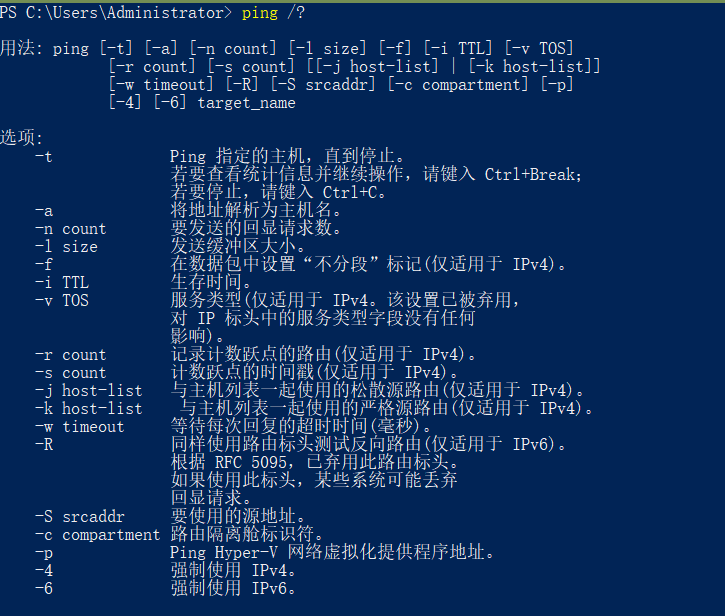
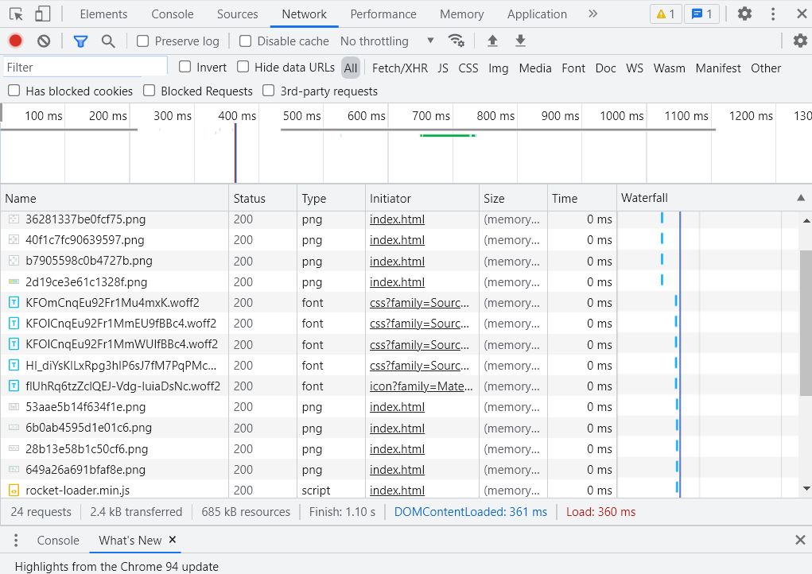
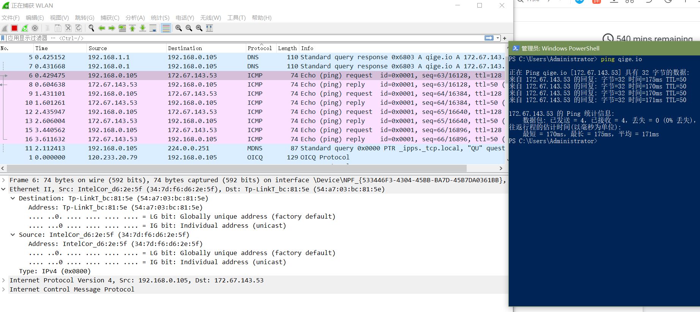
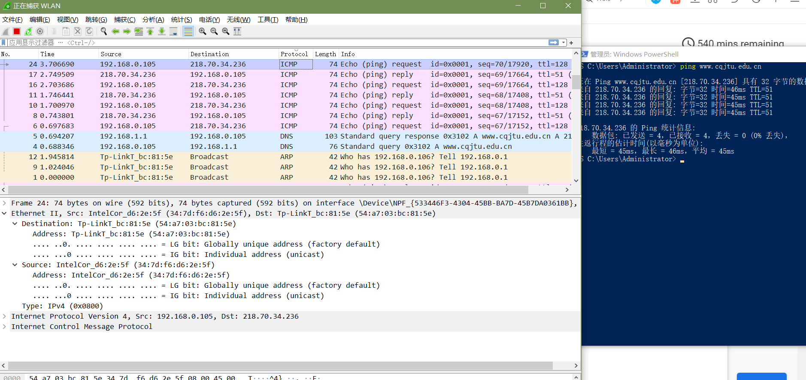
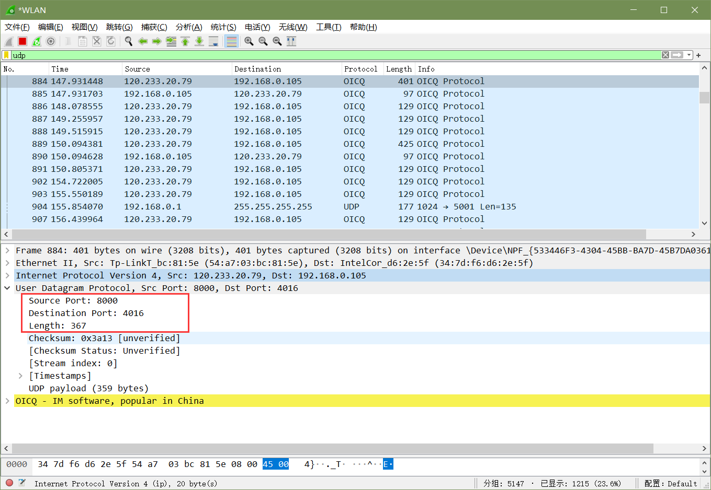

# 验证性实验

## ipconfig

### 实作一

### 实作二

## ping

### 实作一

### 实作二

  

## tracert

### 实作一

### 实作二

  

## ARP

### 实作一

  

### 实作二

 

### 实作三

 

## DHCP

### 实作一

## netstat

### 实作一

### 实作二

 

## DNS

### 实作一

### 实作二

 

 

### 实作三

 

## cache

### 实作一

### 实作二

 

# Wireshark 实验

## 数据链路层

### 实作一

 

可以发现 帧已经被校验了 因此校验字段被wireshark自动去掉了

### 实作二

 

虚拟机应该确实是和本机在同一子网的 可能被防火墙拦截了 所以没ping通

 

 

想要出子网必须要经过网关

访问本子网的计算机时 目的 MAC 就是该主机的

访问非本子网的计算机时 目的 MAC 是网关的

### 实作三

子网主机ping不通 直接ping qige.io试试

 

子网通信都要经过网关的

## 网络层

### 实作一

 

头部长度表明该包头部的长度 可以使得接收端计算出在何处结束及从何处开始读数据

总长度是为了接收端的网络层知晓包含哪些传输的数据

### 实作二

 

### 实作三

 

 

 

TTL从1开始 每经过一个路由就会加1

## 传输层

### 实作一

 

 

### 实作二

TCP三次握手:

 

 

 

特征在于ACK,SEQ不同 三次分别是 (0,1) (1,1) (1,0)

## 应用层

### 实作一

 

 

 

### 实作二

访问什么网站其实都行 随便拿一个http包来分析

这里找到的是post方式发送的包

 

 

响应码200 表示过程正常

响应码304表示请求的对象没有发生改变

浏览器都是会有缓存的 浏览器可以直接使用缓存内的数据 减少网络开销 这样请求的对象就不会发生改变 从而有304响应码
